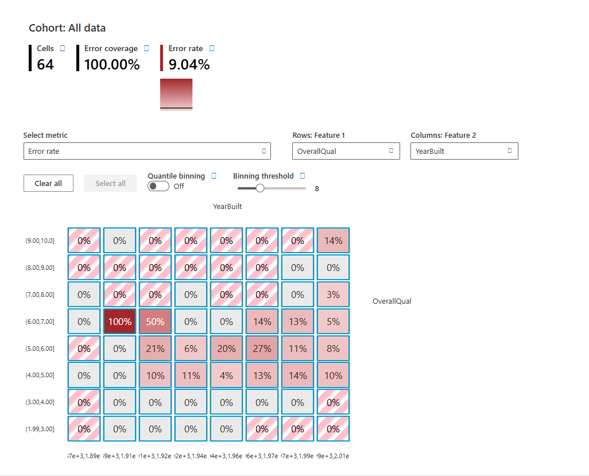
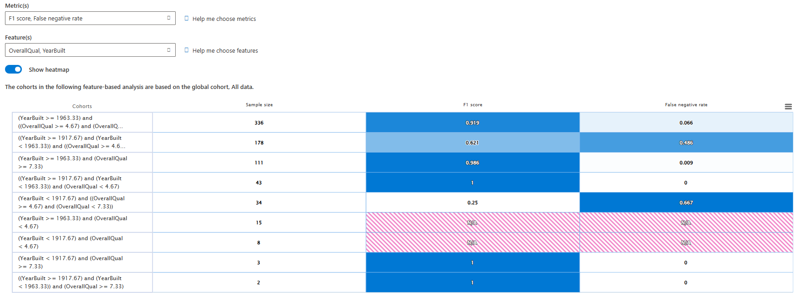

## Notebook analyzed:[Responsible AI Dashboard Housing Classification Model Debugging](https://github.com/microsoft/responsible-ai-toolbox/blob/main/notebooks/responsibleaidashboard/tabular/responsibleaidashboard-housing-classification-model-debugging.ipynb)

## **1. Giới thiệu**
* ## Mục tiêu: Dự đoán một căn nhà thuộc phân khúc ***Cao*** hay ***Thấp*** dựa trên các đặc điểm như diện tích, tổng quan chất lượng, thời điểm xây dựng,... 
* ## Vấn đề cần giải quyết: 
    * ## Mô hình định giá thường gặp rủi ro về Bias đối với các nhóm nhà đặc thù, sử dụng Responsible AI Dashboard để đánh giá độ tin cậy và phát hiện sự Unfairness trong quyết định của mô hình.
    * ## Bài toán Binary Classification với 2 class là:
        | Class	| Giá trị| 
        |-------|--------|	
        | Less than median | 0 |
        | More than median | 1 |
## **2. Các yếu tố chính** 

## Dựa trên biểu đồ, các yếu tố quan trọng nhất ảnh hưởng đến kết quả dự đoán của mô hình là:
* ## **`OverallQual`**: chất lượng tổng thể - yếu tố quan trọng nhất
* ## **`GrLivArea`**: diện tích sinh hoạt - yếu tố quan trọng thứ 2
* ## **`TotlaBsmtSF`**, **`YearBuilt`** và **`LotArea`**: các yếu tố phụ trợ

## Để tìm ra điểm **Unfairness**, ta xét đến cohort `OverallQual` và `YearBuilt` bởi vì mối quan hệ của chúng là non-linear. 
## Ví dụ: xét cohort `OverallQual` và `GrLivArea` thì nhà càng to hoặc càng tốt giá sẽ càng cao, ngược lại với `OverallQual` và `YearBuilt`thì thông thường nhà cũ giá sẽ rẻ, tuy nhiên có tồn tại outliners như nhà cổ chất lượng cao 
## => Nghi ngờ mô hình có thể xảy ra bias đối với những nhà có `YearBuilt` cũ, dẫn đến việc định giá thấp những căn nhà có chất lượng cao.

## **3. Phân tích Error Analysis**

## Nhóm lỗi nghiêm trọng:
* ## Cohort có Error Rate 100% là `OverallQual` thuộc `(6, 7]` và `YearBuilt` thuộc `(1889-1906]`, đây là những ngôi nhà rất cũ và chất lượng ở mức trung bình - khá
* ## => Mô hình không thể dự đoán đúng nhãn `Sold_HigherThan_Median` cho bất kỳ mẫu nào trong nhóm này.
## Nhóm lỗi cao:
* ## Các nhóm này đều thuộc nhà có chất lượng trung bình
* ## Giá bán của nhóm này khó dự đoán hơn do phụ thuộc nhiều của các yếu tố phụ như `TotalBsmtSF`, `LotArea`, `YearRemoteAdd`, ... 
    | OverallQual |	YearBuilt |	Error rate |
    |-------------|-----------|------------|
    | `(5–6]`	| `(1957–11923` |	27% |
    | `(5–6]`	| `(1906–1923]` |21% |
    | `(6–7]`	| `(1940–1957]` |	14%|

## Nhóm tốt: 
* ## Hầu hết các nhóm có `OverallQual` thuộc `(7, 10]` và `(1.99, 4]`, bất kể `YearBuilt` đều có Error Rate gần như bằng 0.
* ## => `OverallQual` là 1 feature mạnh, giúp mô hình đưa ra quyết định chính xác gần như là tuyệt đối.

## **4. Fairness Assessment**

## Để đánh giá Fairness, cần phân tích chỉ số F1 và False Negative Rate (FNR) trên nhóm nhà có chất lượng trung bình - khá `[4.67, 7.33)`
## So sánh hiệu suất theo `YearBuilt`:
| Giai đoạn xây dựng | F1-Score | False Negative Rate |
|--------------------|----------|--------------------|
| YearBuilt >= 1963 | 91.9% | 6.6% |
| 1917 < YearBuilt < 1963| 62.1% | 48.6% |
| YearBuilt < 1917 | 25.0% | 66.7% |
* ## Có sự chênh lệch rất lớn giữa `YearBuilt` >= 1963 và `YearBuilt` < 1917, mô hình biased rất lớn đối với `YearBuilt`
* ## Chỉ số FNR ở `YearBuilt` < 1917 lên tới `66.7%`, có nghĩa là cứ 3 căn nhà cổ sẽ có 2 căn bị mô hình dự đoán nhầm.

## **5. Conclusion**

## Mô hình đạt độ tin cậy cao ở phân khúc rất tốt hoặc rất xấu, nhưng thể hiện sự Unfairness ở các phân khúc trung bình - khá.
## Tỉ lệ bỏ sót còn cao ở các căn nhà cổ giá trị cao có thể gây ra rủ ro lớn nếu áp dụng mô hình vào thực tiễn.
