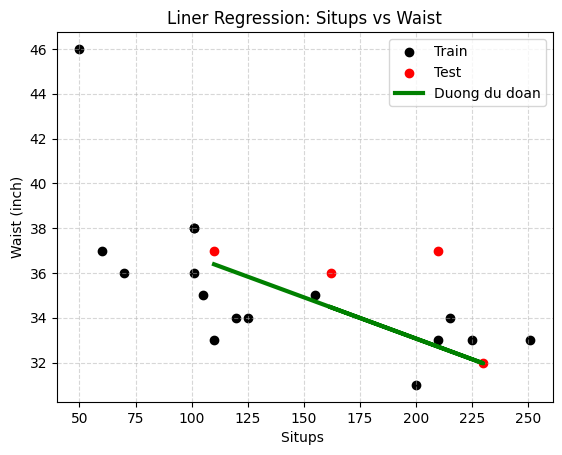
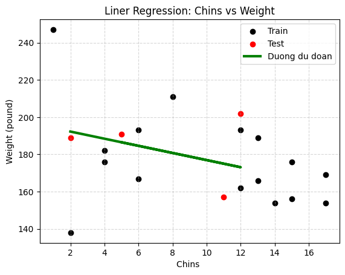
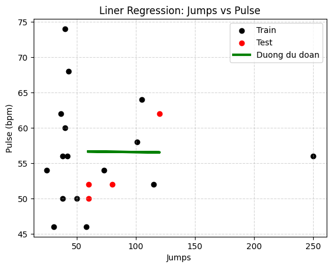

# **Bài tập: Regression with Scikit-learn (Linnerud Dataset)**

## **1. Mô tả phương pháp**

## Phân tích mối quan hệ giữa chế độ tập luyện và chỉ số cơ thể

Quy trình thực hiện bắt đầu với cặp dữ liệu được yêu cầu: `situps` và `waist`.
 
Trích xuất cột dữ liệu tương ứng (index 1) từ tập dữ liệu gốc. Một bước xử lý quan trọng là sử dụng phương thức `.reshape((-1,1))` để chuyển đổi dữ liệu đầu vào về dạng mảng 2 chiều, đảm bảo tương thích với mô hình.
```python
X = linnerud.data[:,2].reshape((-1,1))
y = linnerud.target[:,2]
```
Dữ liệu sau đó được chia thành tập huấn luyện (Train) và tập kiểm thử (Test) theo tỷ lệ 80/20 với `random_state=42` để đảm bảo tính nhất quán.
```python
X_train, X_test, y_train, y_test = model_selection.train_test_split(X, y, test_size=0.2, random_state=42)

```
Sau khi huấn luyện mô hình `LinearRegression` trên tập Train, tôi thực hiện dự đoán trên tập Test và đánh giá độ chính xác bằng chỉ số `RMSE`.

```python
fit_regr = linear_model.LinearRegression()
fit_regr.fit(X_train, y_train)
y_pred = fit_regr.predict(X_test)
```
Đồng thời, tôi cũng xem xét khoảng giá trị (max/min) của biến mục tiêu để có cái nhìn tổng quan. 
```python
print("ket qua test set:")
print(f"Real: {y_test}")
print(f"Pred: {y_pred}")
print(f"MSE:{root_mean_squared_error(y_true=y_test, y_pred=y_pred)}")
print(f"Waist max-min: {y_test.max()}/{y_test.min()}")
```

Kết quả cuối cùng được trực quan hóa bằng biểu đồ phân tán: các điểm dữ liệu thực tế được tô màu đen (Train) và đỏ (Test), trong khi đường hồi quy dự đoán được vẽ màu xanh lá cây đậm để làm nổi bật xu hướng tương quan. Quy trình tương tự cũng được áp dụng để phân tích các cặp biến còn lại trong tập dữ liệu (Chins-Weight, Jumps-Pulse).

### Situps vs Waist (Gập bụng và Vòng eo)

*Xu hướng đường hồi quy đi xuống cho thấy mối tương quan nghịch giữa số lần gập bụng và vòng eo.*

### Chins vs Weight (Hít xà và Cân nặng)

*Xu hướng giảm, người hít xà nhiều hơn thường có cân nặng thấp hơn.*

### Jumps vs Pulse (Nhảy và Nhịp tim)

*Đường dự đoán gần như nằm ngang, cho thấy ít có mối liên hệ tuyến tính giữa hai biến này trong tập dữ liệu mẫu.*