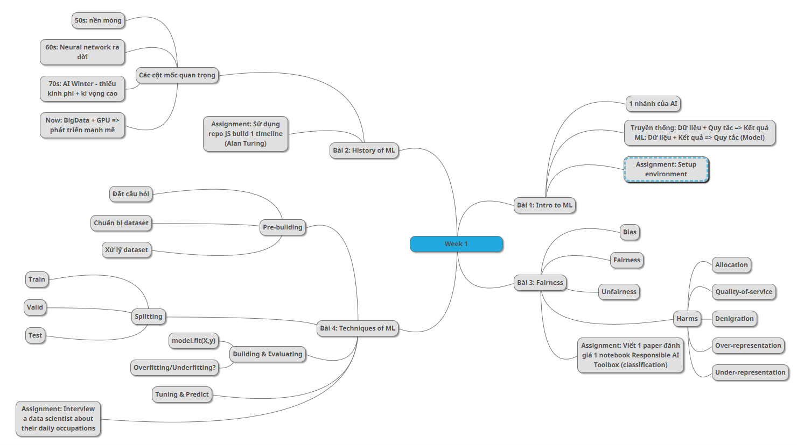

# **Liver Diseases Detection**

## A Flask-based web application for liver diseases prediction from histopathology images.

# **Tuần 1 (17/11/2025 - 21/11/2025)**

> ## ***18/11/2025***
## **Những gì đã học và làm được**

* ## Học được các cú pháp cơ bản của Markdown.
* ## Học được cách tạo diagram và chart cơ bản bằng Mermaid
* ## Fork dataset từ [liver disease Computer Vision Model](https://universe.roboflow.com/anusha-shetty-eprky/cancer-vvl9r/browse?queryText=like-image%3A7CPVxTMvh2roMPYBgnOZ&pageSize=50&startingIndex=0&browseQuery=true) rồi tiến hành tiền xử lý và thêm các augment để training model YOLOv8
* ## Học được cách train model thu được file trọng số `best_model.pt` để tích hợp vào backend
* ## Sử dụng Flask xây dựng 1 web application python:
    * ## Backend: Xây dựng 1 server Flask, xây dựng logic API (`api/predict`) nhận file ảnh, vẽ bounding box, encoded Base64 và trả về kết quả dự đoán dạng `JSON` 
    * ## Frontend: Xây dựng giao diện (UI) đơn giản bằng **HTML5, CSS3, và JavaScript**, sử dụng **Fetch API** gửi `formData` đến backend, xử lý `JSON` trả về để hiển thị lên giao diện 

## **Hướng giải quyết đã thực hiện** 
* ## Sau khi train lại với tỉ lệ train/valid/test là 70/20/10 thì model trả về kết quả dự đoán tốt hơn khi test ảnh valid cho ra kết quả dự đoán đúng (>80%)


> ## ***19/11/2025***

## **Những gì đã học và làm được**
* ## Tìm ra hướng giải quyết cho vấn đề tồn đọng
* ## Tìm hiểu cách cơ bản để deploy lên Render
* ## Tìm hiểu cách bảo mật file `.pt` khi deploy lên môi trường production: lưu file trọng số vào googledrive, server tự động tải model sử dụng file ID được bảo mật trong Environment Variable của Render khi khởi động

# **Tuần 2 (24/11/2025 - 28/11/2025)**

## **Nghỉ do thiệt hại mưa lũ**

# **Tuần 3 (1/12/2025 - 5/12/2025)**

>## ***1-5/12/2025***

## **Những gì đã học và làm được**
* ## Tìm hiểu các hàm biến đổi ảnh thực thi như thế nào với thư viện OpenCV 
* ## Tiếp tục tìm hiểu về dataset được sử dụng
* ## Cải thiện lại ở bước prepossesing và augmentation dataset chính xác hơn
* ## Retrain model với dataset mới 

# **Tuần 4 (8/12/2025 - 12/12/2025)**

> ## ***8-12/12/2025***

## **Những gì đã học và làm được**
* ## Đổi lại bộ dataset từ classification mô bệnh tế bào ung thư (tế bào bình thường và tế bào ung thư giai đoạn 1,2,3) sang object detection các bệnh về gan (gan phình to, xơ gan, viêm gan, gan nhiễm mỡ).
* ## Train lại 
* ## Sửa lại demo
* ## Viết báo cáo

# **Tuần 5 (15/12/2025 - 19/12/2025)**

> ## ***15/12/2025***

## **Những gì đã học và làm được**
* ## Bài 1: Introduction_1-intro-to-ml của khóa ML for Beginners
    * ## Nắm nội dung của bài
    * ## Hoàn thành assignment: Setting environment
* ## Bài 2: Introduction_2-history-of-ML của khóa ML for Beginners
    * ## Nắm nội dung của bài
    * ## Hoàn thành assignment: Tạo timeline  
    * ## Assignment overview
        Timeline of the Life and Career of **Alan Turing** – The Father of Artificial Intelligence
        * Demo: [https://ducanh-2003.github.io/timeline-builder/](https://ducanh-2003.github.io/timeline-builder/)
        * Source code: [https://github.com/Ducanh-2003/timeline-builder](https://github.com/Ducanh-2003/timeline-builder)
    ## Rubric

    | Criteria | Exemplary                                         | Adequate                                | Needs Improvement                                                |
    | -------- | ------------------------------------------------- | --------------------------------------- | ---------------------------------------------------------------- |
    |          |[x] A deployed timeline is presented as a GitHub page | The code is incomplete and not deployed | The timeline is incomplete, not well researched and not deployed |

> ## ***16-17/12/2025***
## **Những gì đã học và làm được**
* ## Bài 3: Introduction_3-fairness của khóa học ML for Beginners
    * ## Nắm nội dung lý thuyết của bài
    * ## Hoàn thành assigment: Chạy notebook, viết paper rút ra kết luận về notebook đó
    * ## Assignment overview
        [Notebook binary classification](https://github.com/microsoft/responsible-ai-toolbox/blob/main/notebooks/responsibleaidashboard/tabular/responsibleaidashboard-housing-classification-model-debugging.ipynb)

        [Paper](1-Introduction/3-fairness/ASSIGNMENT_PAPER.md)
    ## Rubric
    | Criteria | Exemplary | Adequate | Needs Improvement |
    | -------- | --------- | -------- | ----------------- |
    |          | [x] A paper or powerpoint presentation is presented discussing Fairlearn's systems, the notebook that was run, and the conclusions drawn from running it        |   A paper is presented without conclusions       |  No paper is presented                 |

> ## ***18/12/2025***
## Những gì đã học và làm được
* ## Bài 4: Introduction_4-techniques-of-ML của khóa học ML for Beginners
    * ## Nắm nội dung lý thuyết của bài
    * ## Không hoàn thành assignment
    ## Rubric

    | Criteria | Exemplary                                                                            | Adequate                                                           | Needs Improvement     |
    | -------- | ------------------------------------------------------------------------------------ | ------------------------------------------------------------------ | --------------------- |
    |          | An essay of the correct length, with attributed sources, is presented as a .doc file | The essay is poorly attributed or shorter than the required length |[x] No essay is presented |

> ## ***19/12/2025***
## Những gì đã học và làm được
* ## Mindmaps tổng kết tuần 1: 
* ## Luyện code với thư viện Numpy: từ bài 1 tới 30 
* ## Luyện code với thư viện Pandas: bài 1 - Getting & Knowing your data

# **Tuần 6 (22/12/2025 - 26/12/2025)**

> ## ***22/12/2025***
## Những gì đã học và làm được
* ## Bài 5: Regression_1-Tools của khóa học ML for Beginners
  * ## Nắm nội dung lý thuyết của bài 
  * ## Hoàn thành assignment: viết 1 paragraph các bước tạo model LinearRegression và vẽ biểu đồ
  * ## Assignment overview
    [Assignment paragraph](2-Regression/1-Tools/ASSIGNMENT_PARAGRAPH.md)
  ## Rubric
  | Criteria                       | Exemplary                           | Adequate                      | Needs Improvement          |
  | ------------------------------ | ----------------------------------- | ----------------------------- | -------------------------- |
  | Submit a descriptive paragraph | [x] Well-written paragraph is submitted | A few sentences are submitted | No description is supplied |

> ## ***23/12/2025***
## Những gì đã học và làm được
* ## Bài 6: Regression_2-Data của khóa học ML for Beginners
    * ## Nắm nội dung lý thuyết của bài
    * ## Hoàn thành assignment: Chuẩn hóa dữ liệu rồi tạo  biểu đồ với 2 thư viện matplotlib và seaborn để so sánh giữa 2 lib
    * ## Assignment overview
        [Exploring Visualizations notebook](2-Regression/2-Data/assignment_notebook.ipynb)
    ## Rubric
    | Criteria | Exemplary | Adequate | Needs Improvement |
    | -------- | --------- | -------- | ----------------- |
    |          |[x] A notebook is submitted with two explorations/visualizations         |   A notebook is submitted with one explorations/visualizations       |  A notebook is not submitted                 |


---

## Dataset: https://universe.roboflow.com/roboflow-100/liver-disease

## Cấu trúc dataset: 3976 ảnh

| Phân lớp | Train (70%) | % | Valid (20%) | % | Test (10%) | % | Tổng |
|---------|-------------|----|-------------|----|-------------|----|------|
| Ballooning (lớp 0) | 698 | 25.10% | 198 | 24.94% | 100 | 25% | 996 |
| Fibrosis (lớp 1) | 694 | 24.95% | 198 | 24.94% | 100 | 25% | 992 |
| Inflammation (lớp 2) | 688 | 24.73% | 196 | 24.68% | 100 | 25% | 984 |
| Steatosis (lớp 3) | 694 | 24.95% | 198 | 24.94% | 100 | 25% | 992 |
| Null | 8 | 0.29% | 4 | 0.5% | 0 | 0% | 12 |
| **Tổng cộng** | **2782** |  | **794** |  | **400** |  | **3976** |


## Tài liệu tham khảo: 
## https://docs.roboflow.com/datasets/dataset-versions/image-preprocessing
## https://docs.roboflow.com/datasets/dataset-versions/image-augmentation
## https://docs.roboflow.com/annotate/use-roboflow-annotate#mark-null
## https://docs.ultralytics.com/models/yolov8
## https://yolov8.org/how-to-use-yolov8-for-object-detection/


## **Link demo:** [](https://liverdiseases-detection-1.onrender.com/)

## **Flowchart:**
```mermaid
---
config:
  layout: dagre
---
flowchart TB
    subgraph Init [KHỞI TẠO SERVER]
        direction TB
        Start((Start)) --> Download[Tải từ Google Drive<br>dùng gdown]
      
        Download --> LoadRAM
       
    end
 subgraph Client["CLIENT"]
    direction TB
        Start(("User chọn ảnh"))
        Form["Tạo FormData<br>&amp; Gửi Fetch API"]
        Display["Hiển thị ảnh đã được bounding box với label và conf"]
        End(("Kết thúc"))
  end
 subgraph Server["SERVER"]
    direction TB
        Recv["Flask nhận /api/predict;<br>Convert sang PIL Image;<br>Gọi model YOLOv8 dự đoán"]
        Predict["YOLOv8 Dự đoán;<br>Dùng .plot của Ultralytics vẽ bounding box tự động"]
        Response["Mã hóa ảnh thành chuỗi Base64;<br>Trả về JSON gồm ảnh và kết quả dự đoán chứa label và conf"]
  end
    Start --> Form
    Display --> End
    Recv --> Predict
    Predict --> Response
    Form -- "1. Gửi Ảnh" --> Recv
    Response -- "2. Trả JSON" --> Display

    style Init fill:#fff0f5,stroke:#db7093,stroke-width:2px,color:#000
    style Client fill:#e6f7ff,stroke:#1890ff,stroke-width:2px,color:#000
    style Server fill:#fffbe6,stroke:#faad14,stroke-width:2px,color:#000

    
